# R8it Store Rating website

A fullstack web application for discovering, rating, and managing stores. Built with **React (Vite)** frontend and **Node.js/Express/Sequelize** backend, with PostgreSQL database. Easily deployable to Railway (backend/database) and Vercel (frontend).

## 🌐 Live Demo

**[🚀 Try the App → r8it-app.vercel.app](https://r8it-app.vercel.app)**

---

## 📸 Screenshots

<div align="center">

| 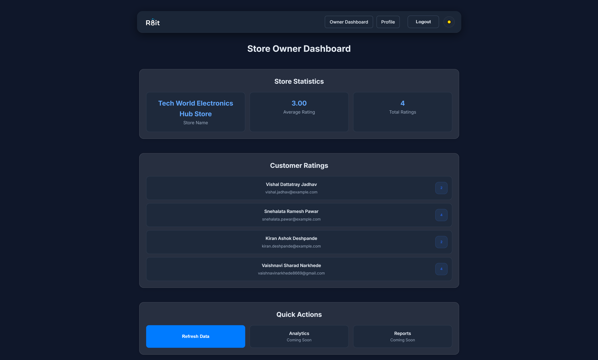 | 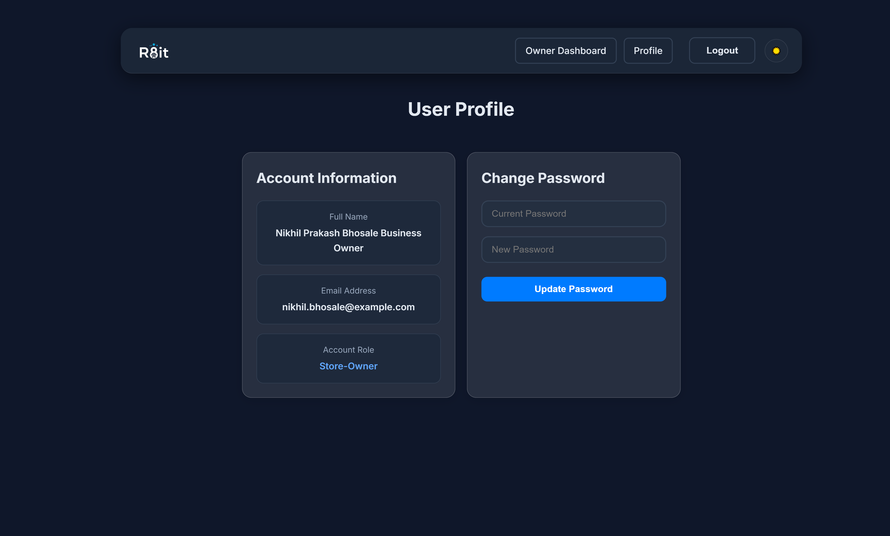 | 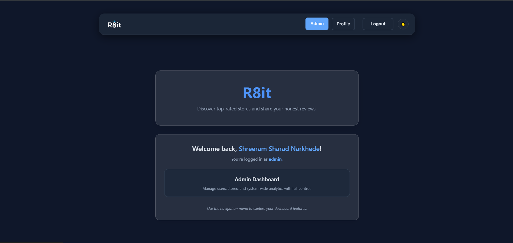 |
|:---:|:---:|:---:|
| **Owner Dashboard** | **User Profile** |
 **Home Page** |

| 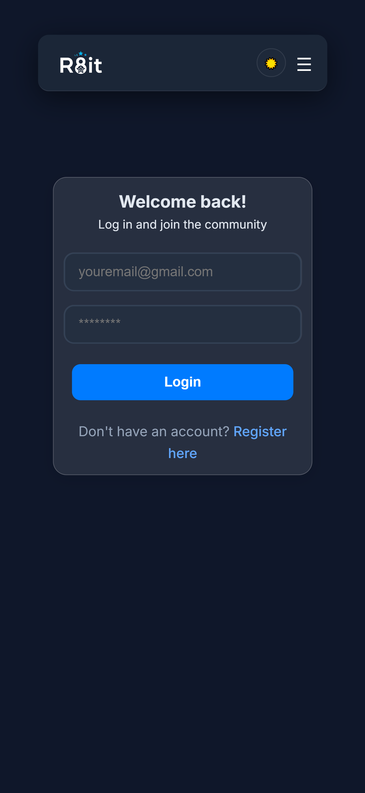 | 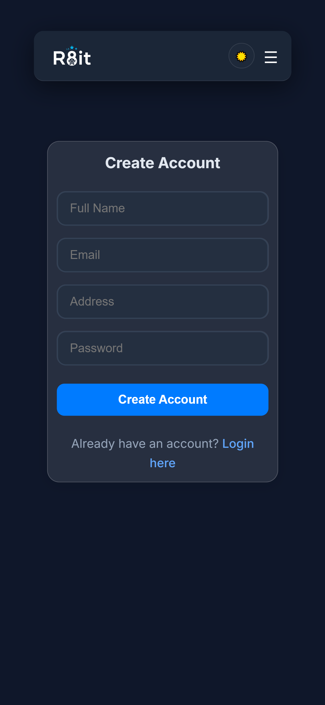 | 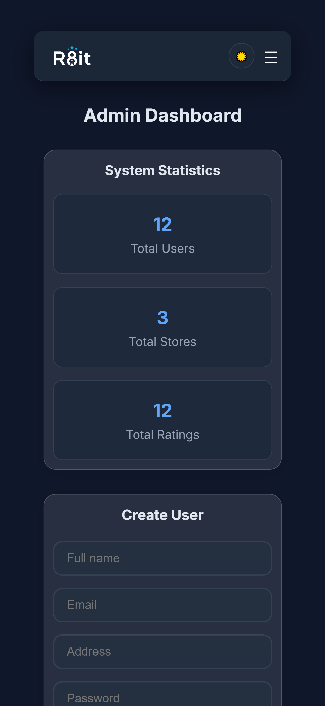 |
|:---:|:---:|:---:|
| **Mobile Navigation** | **Mobile Store List** | **Mobile View** |

| 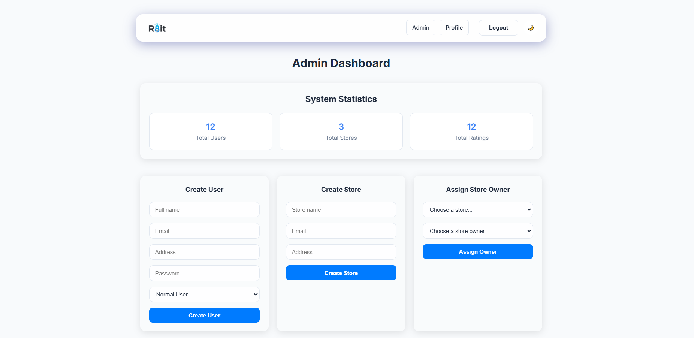 |  | 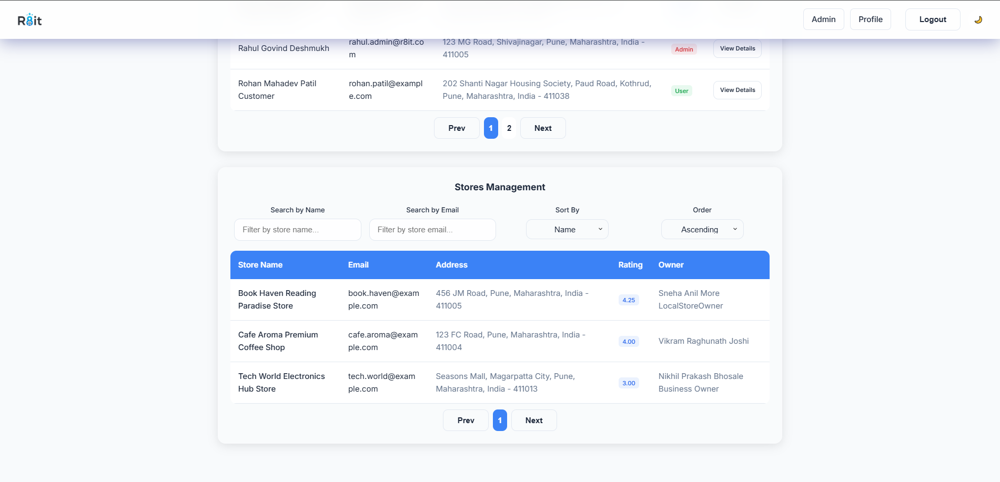 |
|:---:|:---:|:---:|
| **Admin Panel** | **Admin  panel** | **Admin Dashboard** |

| 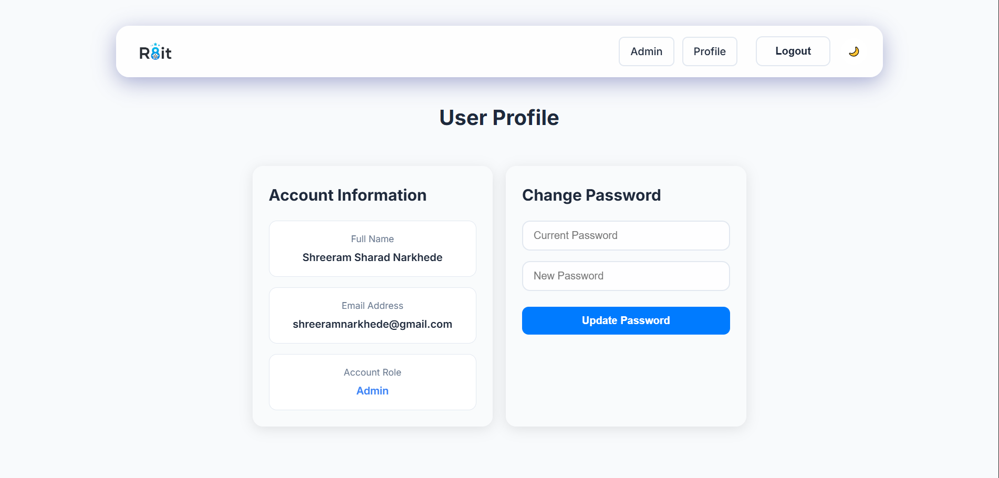 | 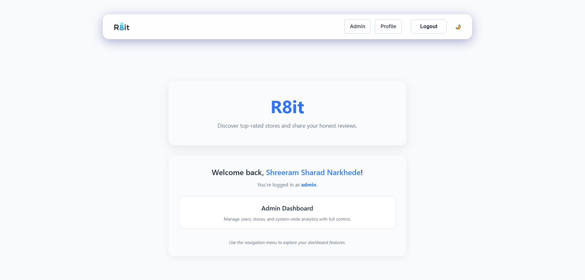 | 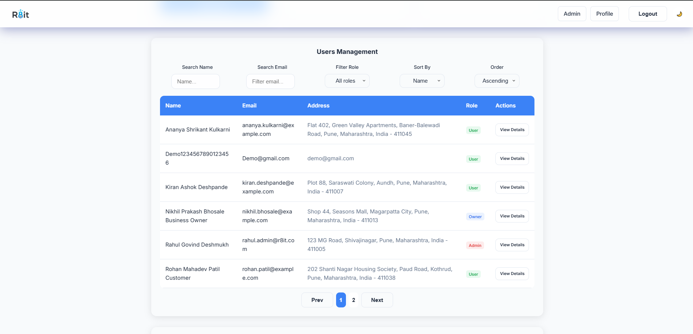 |
|:---:|:---:|:---:|
| ** Profile** | **Rating Interface** | **Advanced Options** |

</div>

---

## 🚀 Features


- **User Authentication** (JWT)
- **Role-based Dashboards**: Admin, Store Owner, User
- **Store Management**: Create, assign owners, rate, and review stores
- **User Management**: Admin can manage users and roles
- **Responsive UI**: Mobile-first, glassmorphism design
- **API Integration**: RESTful backend
- **Docker Compose** for local development

---

## 🛠️ Tech Stack

- **Frontend**: React 19, Vite, React Router DOM 7, Axios, Lottie, ESLint
- **Backend**: Node.js, Express, Sequelize, PostgreSQL, JWT, Joi, Helmet, CORS
- **Database**: PostgreSQL
- **DevOps**: Docker, Docker Compose, Railway, Vercel

---

## 📦 Monorepo Structure

```
store-rating-app/
  ├── backend/      # Express API, Sequelize models, routes, config
  ├── frontend/     # React app (Vite), components, pages, state
  ├── docker-compose.yml
  ├── .gitignore
  └── README.md     # (this file)
```

---

## ⚡ Quick Start (Local)

### 1. Clone & Install

```bash
git clone https://github.com/yourusername/store-rating-app.git
cd store-rating-app

# Backend
cd backend
npm install

# Frontend
cd ../frontend
npm install
```

### 2. Environment Variables

- Copy `.env.example` to `.env` in both `backend/` and `frontend/` and fill in values as needed.

### 3. Start PostgreSQL (Docker)

```bash
docker-compose up -d
```

### 4. Start Backend

```bash
cd backend
npm run dev
# or: npm start
```

### 5. Start Frontend

```bash
cd ../frontend
npm run dev
```

- Frontend: [http://localhost:5173](http://localhost:5173)
- Backend API: [http://localhost:5000/api](http://localhost:5000/api)

---

## 🏗️ Production Deployment

### Railway (Backend + DB)

- Deploy `backend/` as a Railway service (Dockerfile or Nixpacks).
- Add a PostgreSQL plugin in Railway.
- Set environment variables (`DATABASE_URL`, `JWT_SECRET`, etc).

### Vercel (Frontend)

- Deploy `frontend/` to Vercel.
- Set `VITE_API_URL` in Vercel project settings to your Railway backend URL (with `/api`).

---

## 📝 Environment Variables

- See `backend/env.example` and `frontend/env.example` for all required variables.

---

## 🛡️ Linting

```bash
# Frontend
cd frontend
npm run lint

# Backend
cd ../backend
npm run lint   # (if you add a linter)
```

---

## 🤝 Contributing

Pull requests are welcome! For major changes, please open an issue first.

---

## 📄 License

MIT
